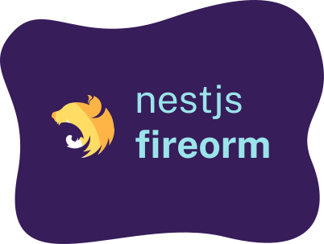

<p align="center">
  
</p>

<h1 align="center">NestJS Fireorm</h1>

<p align="center">
  <strong>Wrapper for NestJS / Fireorm</strong>
</p>

[](https://github.com/glebbash/nestjs-fireorm)
[](https://github.com/glebbash/nestjs-fireorm/actions)
[](https://coveralls.io/github/glebbash/nestjs-fireorm?branch=master)

`nestjs-fireorm` is a tiny [Nest.js][] [Fireorm][] module.

> Fireorm 🔥 is a tiny wrapper on top of firestore that makes life easier when dealing with a
> Firestore database.

This module makes it easier to deal with Firestore database when using Nest.js!

**docs**: https://glebbash.github.io/nestjs-fireorm/

---

Let's get started!

```sh
npm i nestjs-fireorm
```

This module is based on [Fireorm]. The [FireORM documentation][fireorm-docs] is a great resource to
understand how `nestjs-fireorm` works. You'll need to add `nestjs-fireorm` to your root module,
which you can do like this:

```typescript
import { Module } from '@nestjs/common';
import { FireormModule } from 'nestjs-fireorm';

@Module({
  imports: [
    FireormModule.forRoot({
      fireormSettings: { validateModels: true },
    }),
  ],
})
export class AppModule {}
```

_There are other examples, which you can find in our repository [app.module.ts][app-module]._

To improve developer readability, we suggest using the same semantics as defined in [Nest's
documentation on database][nest-db]. Like, when creating a User type, we suggest using the name
`user.entity.ts`:

```typescript
import { Collection } from 'fireorm';

@Collection()
export class UserEntity {
  id!: string;
}
```

Read more about [Fireorm's core concepts][fireorm-core] on how _entities_ should be defined.

Entities has to be imported in your module, and we expose a simple method to do this, which looks like
this:

```typescript
import { Module } from '@nestjs/common';
import { FireormModule } from 'nestjs-fireorm';
import { User } from './entities/user.entity';

@Module({
  imports: [FireormModule.forFeature([User])],
})
export class AppModule {}
```

We'll need to inject the [repository]. `nestjs-fireorm` comes with a special `InjectRepository`
function, which is used like this:

```typescript
import { InjectRepository } from 'nestjs-fireorm';

constructor(
  @InjectRepository(User)
  private users: BaseFirestoreRepository<User>
) {}
```

[fireorm]: https://fireorm.js.org
[fireorm-docs]: https://fireorm.js.org/
[fireorm-core]: https://fireorm.js.org/#/Core_Concepts
[fireorm-repository]: https://fireorm.js.org/#/Core_Concepts?id=fireorm-repositories
[nest.js]: https://nestjs.com
[nest-db]: https://docs.nestjs.com/techniques/database
[app-module]: https://github.com/glebbash/nestjs-fireorm/blob/master/example/src/app.module.ts

## Documentation

Apart from this README, you can find examples of using the library in the following places:

- [Example usage][]

[example usage]: https://github.com/glebbash/nestjs-fireorm/tree/master/example

Bootstrapped with: [create-ts-lib-gh](https://github.com/glebbash/create-ts-lib-gh)

This project is [MIT Licensed](LICENSE).
